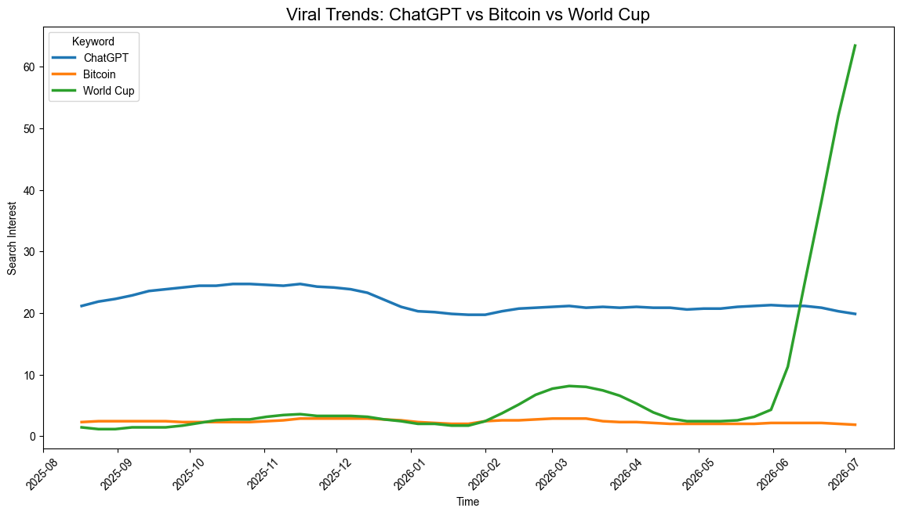
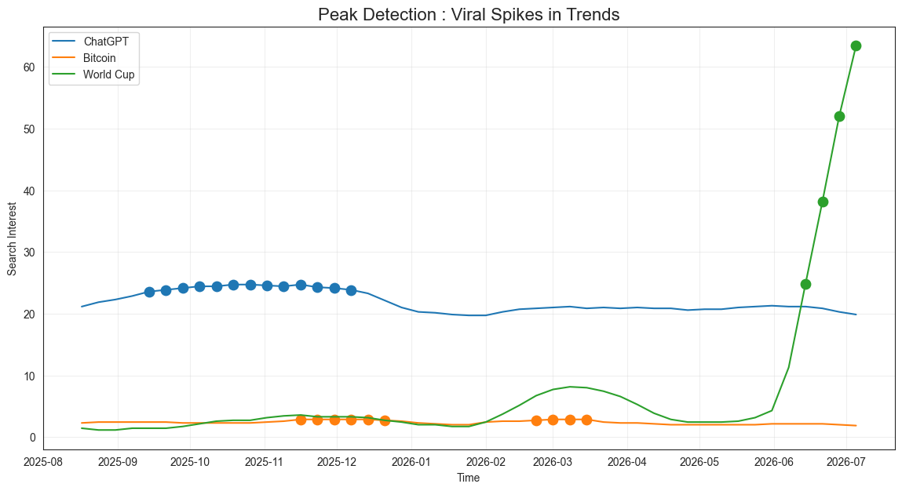
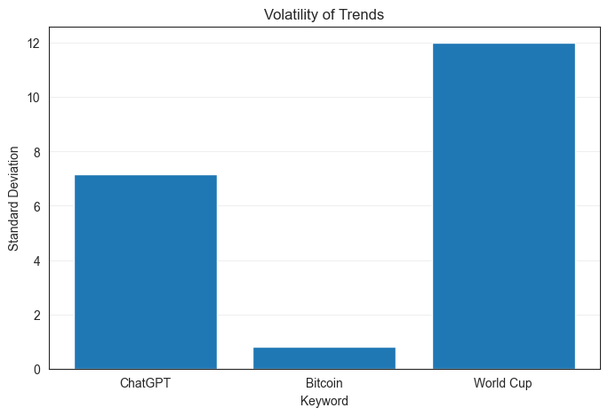
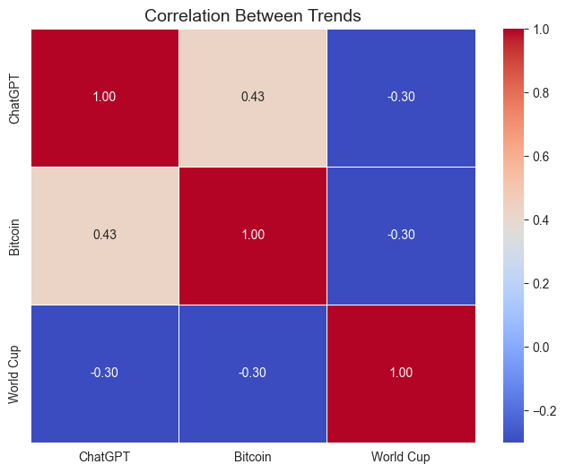
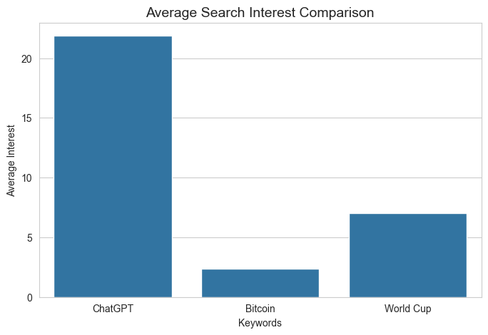
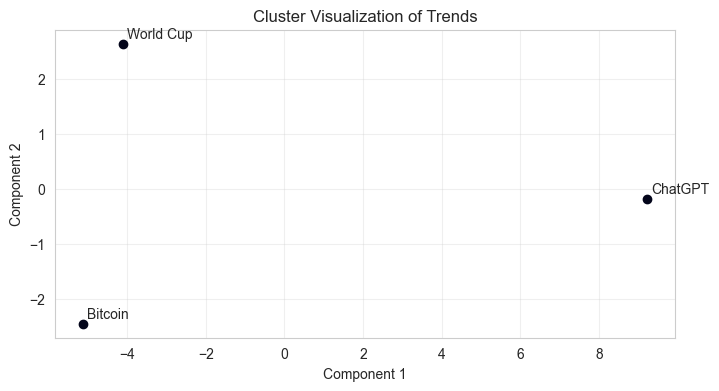

# 🚀 Rise, Peak, Die: The Data Science of Viral Trends

Analysis of how different topics trend over time using Google Trends data — tracking growth, peaks, and volatility to understand _why_ some trends explode and others fizzle.

---

## 📌 Overview

This project explores the lifecycle of viral trends using real-world Google Trends data. It compares three very different categories of topics to see whether their "rise, peak, die" curves follow similar or distinct patterns.

**Keywords analyzed:**

- ChatGPT
- Bitcoin
- FIFA World Cup

---

## 🎯 Objectives

- Analyze growth patterns of trends over time
- Identify peak points for each keyword
- Compare stability vs. volatility across trend types
- Group similar trends together using clustering

---

## 📊 Methods

| Step                | Technique                            |
| ------------------- | ------------------------------------ |
| Data Collection     | Pytrends (Google Trends API wrapper) |
| Data Processing     | Pandas                               |
| Visualization       | Matplotlib, Seaborn                  |
| Peak Detection      | Local maxima detection               |
| Clustering          | K-Means                              |
| Volatility Analysis | Standard Deviation                   |

---

## 📈 Key Results

- **ChatGPT** shows a steady, sustained growth pattern
- **Bitcoin** and **FIFA World Cup** show high fluctuations
- **Clustering groups:**
  - ChatGPT → separate cluster (steady growth)
  - Bitcoin & World Cup → similar behavior (spiky/volatile)
- **FIFA World Cup** has the highest volatility overall

### 🖼️ Visualizations

**Trend Over Time**


**Peak Detection**


**Volatility Comparison**


**Correlation Heatmap**


**Average Interest Comparison**


**Clustering Results (K-Means)**


---

## 🧠 Key Insights

- **Event-driven trends** (e.g., FIFA World Cup) → sharp, short-lived spikes
- **Market-driven trends** (e.g., Bitcoin) → frequent, unpredictable fluctuations
- **Technology trends** (e.g., ChatGPT) → more stable, sustained growth
- Not all trends behave the same — the _cause_ of a trend shapes its curve

---

## 🛠️ Tech Stack

- Python
- Pandas, NumPy
- Matplotlib, Seaborn
- Scikit-learn
- Pytrends

---

## 🚀 Run Locally

Clone the repository:

```bash
git clone https://github.com/your-username/your-repo-name.git
cd your-repo-name
```

Install dependencies:

```bash
pip install pandas numpy matplotlib seaborn scikit-learn pytrends
```

Launch the notebook:

```bash
jupyter notebook
```

---

## 📂 Structure

```
├── graphs/
│   ├── avg_barplot.png
│   ├── cluster.png
│   ├── heatmap.png
│   ├── lineplot.png
│   ├── peak_detection.png
│   └── volatility.png
├── main.ipynb
├── trends.csv
└── README.md
```

---

## 🔮 Future Work

- [ ] Add more keywords
- [ ] Build interactive dashboard (Streamlit)
- [ ] Trend prediction using time-series forecasting

---

## ✅ Conclusion

Different types of trends show distinct behavioral patterns in growth, peaks, and volatility. Technology trends tend to grow steadily, while event- and market-driven trends spike and fluctuate sharply — proving that not all viral moments are created equal.
